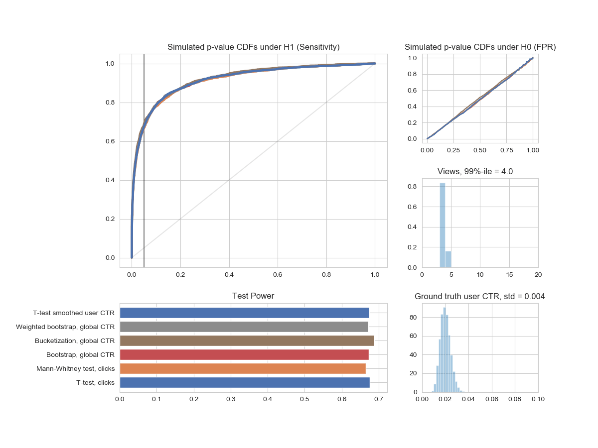

# Practitioner's Guide to Statistical Tests

Source code to reproduce experiments from the article [Practitioner’s Guide to Statistical Tests](https://medium.com/@vktech/practitioners-guide-to-statistical-tests-ed2d580ef04f)



To play with statistical tests use [Sandbox.ipynb](./notebooks/Sandbox.ipynb) notebook. You can change the following data generation parameters:
```python
success_rate = 0.02
uplift = 0.2
N = 5000 # Number of users in groups
NN = 2000 # Number of runs

beta = 1000
skew = 1
```
Read the [article](https://medium.com/@vktech/practitioners-guide-to-statistical-tests-ed2d580ef04f) for the details.

To reproduce gifs and plots from the article use [assets.ipynb](./notebooks/assests.ipynb) notebook.

#### Authors

- [Daniel Savenkov](https://github.com/Danila89)
- [Nikita Marshalkin](https://github.com/marnikitta)


